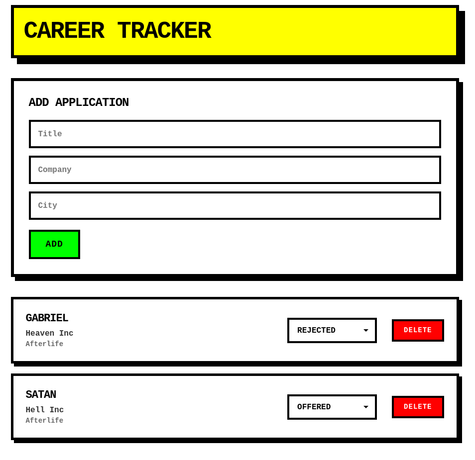

# Career Tracker

**Career Tracker** is a full-stack web application for tracking job applications in a structured and centralized way. It features a React frontend, a FastAPI backend, and a PostgreSQL database.

_Used pure CSS to create a neobrutalism inspired UI_



## 🚀 Overview

Users can:

- Register or login (using JWTs)
- Create and manage job applications
- Track application status

Basically this project replaces spreadsheets with a clean web solution.

## 🛠 Tech Stack

- **Frontend:** React (TypeScript)
- **Backend:** FastAPI (Python)
- **Database:** PostgreSQL
- **API:** REST
- **Config:** Environment variables (`.env`)

## ⚙️ Setup

### Environment Variables

Each service includes a `.env.template` file.

```bash
cp .env.template .env
```

Fill in the required values before running the app.
`.env` files are excluded from version control.

---

### Backend

```bash
cd backend
python -m venv venv
source venv/bin/activate   # macOS/Linux
pip install -r requirements.txt
python main.py
```

### Frontend

```bash
cd frontend
npm install
npm run dev
```
